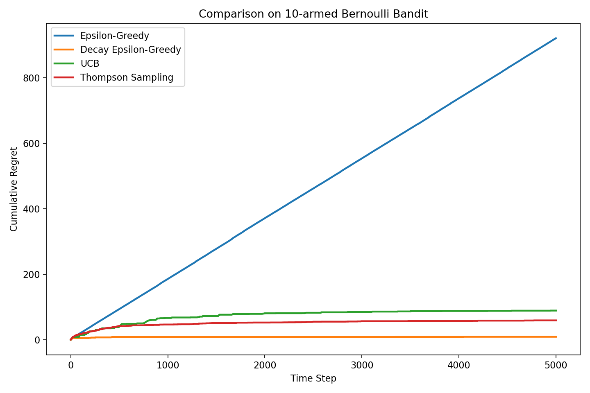
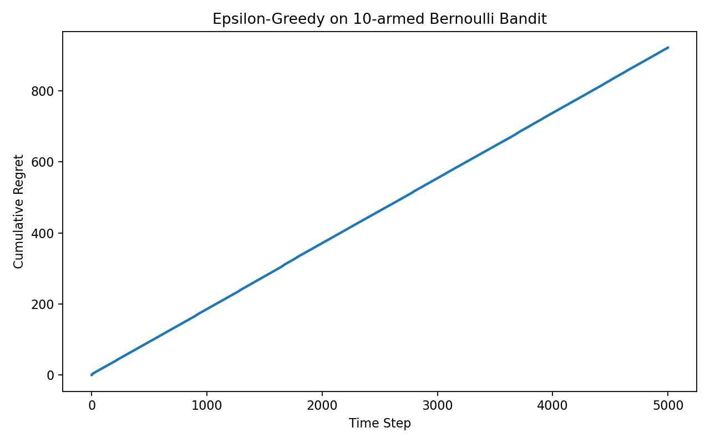
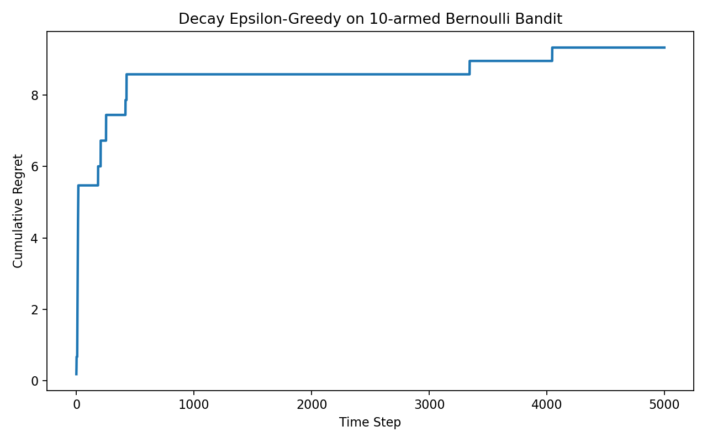
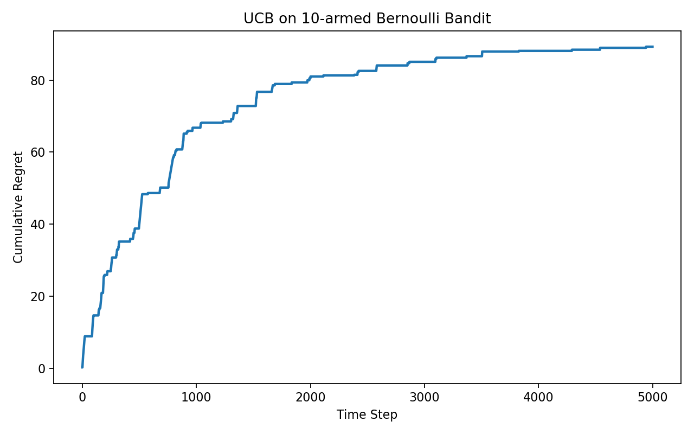
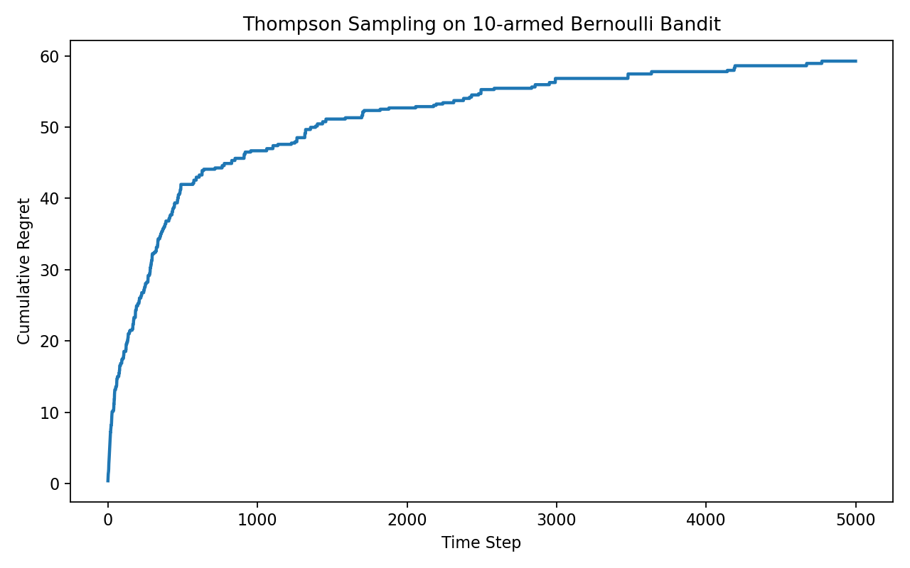

# 多臂老虎机学习笔记

前一段时间我已经开始正式接触强化学习了，但回头再看，会发现自己多少有点眼高手低。一上来就急着往 Q-learning、DQN 这些更“正式算法”的内容里冲，结果很多基础概念其实并没有真正吃透。于是我决定先退回来，好好重头开始学一下这些最经典的模型。

多臂老虎机这个模型之所以重要，不是因为它本身有多复杂，恰恰是因为它足够简单。它拿掉了强化学习了状态这一观点，只保留了一个最核心的问题：在信息不完整、反馈带随机性的情况下，应该怎样一边试、一边学、一边逐步把决策做对。换句话说，它先把强化学习里“探索”和“利用”的矛盾单独拎了出来，让我们能够先把这个最底层的问题看清楚。

在这个问题里，智能体面前有 `K` 根拉杆，每根拉杆被拉动以后都有一定概率获得奖励，但这些概率一开始并不知道。智能体要做的，不是机械地把每根杆子都试一遍，而是在不断尝试的过程中尽量多拿奖励，同时尽快找出真正最优的那一根。这个过程看起来很简单，但它已经包含了强化学习最重要的味道：眼前看到的结果不一定可靠，长期最优也不可能一开始就知道，决策必须在试错中逐步修正。

如果把这个模型和后面的 Q-learning、DQN 放在一起看，它们最大的区别就在于这里几乎没有“状态”这个概念。每一步环境都没有发生本质变化，智能体始终面对的是同一组拉杆，因此也不存在 `state -> next_state` 这样的状态转移。也正因为如此，多臂老虎机里学到的不是“某个状态下哪个动作更好”，而是更直接的问题：从长期来看，哪一个动作整体上最值得反复选择。可以把它理解成一个只有单一隐含状态的强化学习问题。

## 1. 背景与问题本质

多臂老虎机最值得先想清楚的一点，是它真正难的地方并不在环境，而在决策。因为每根拉杆的回报都带随机性，所以单次反馈本身并不能直接说明一根拉杆到底好不好。一根真实中奖概率很高的拉杆，这次也可能没有中奖；而一根真实概率很低的拉杆，也完全可能恰好在前几次里表现得很好。于是问题就来了：如果我永远只选当前看起来最好的那根拉杆，虽然短期内似乎比较稳，但我很可能因为前期样本太少，过早卡在一个次优动作上；如果我经常随机去试别的拉杆，虽然更有可能发现真正更好的动作，但也会付出不少试错成本。

这就是所谓的探索与利用矛盾。利用意味着优先选择当前最看好的动作，探索则意味着主动给那些还不够确定的动作机会。强化学习后面很多算法看起来形式复杂，但如果往底下追，几乎都绕不开这层逻辑。多臂老虎机的价值，就在于它把这件事压缩到了最简单的形态，让我们能够先建立一套清晰的直觉，再去理解更复杂的状态型决策问题。

## 2. 核心概念、定义与公式推导

在这个问题里，有几个概念必须先分清楚。第一层是单次奖励 `r`，它描述的是某一次拉动之后到底有没有中奖；第二层是真实概率 `p`，它表示的是某根拉杆长期平均能带来多大的收益；第三层是估计值 `Q`，也就是智能体根据目前已经收集到的历史信息，对这根拉杆真实表现做出的当前判断。学习过程真正要做的事情，并不是盯着某一次奖励本身，而是通过不断积累样本，让这个估计值逐渐逼近真实概率。

在代码里，环境用 `BernoulliBandit`来表示。每根拉杆都对应一个固定但未知的中奖概率，每次拉动只会返回 `0` 或 `1`，因此这其实就是一个非常标准的伯努利分布建模。这样一来，问题就很自然地变成了：如何根据一串 `0/1` 奖励，在线更新每根拉杆的平均收益估计。

这部分最关键的地方，就是奖励估计值的更新公式。假设某一根拉杆已经被拉了 `k` 次，对应观测到的奖励依次为 `r_1, r_2, ..., r_k`，那么第 `k` 次更新之后，这根拉杆的奖励期望最自然的定义，就是前 `k` 次奖励的平均值：

```math
Q_k = \frac{1}{k}\sum_{i=1}^{k} r_i
```

接着把最后一次奖励单独拆出来，就得到：

```math
Q_k = \frac{1}{k}\left(r_k + \sum_{i=1}^{k-1} r_i\right)
```

而前 `k-1` 次的平均奖励可以写成：

```math
Q_{k-1} = \frac{1}{k-1}\sum_{i=1}^{k-1} r_i
```

于是有：

```math
\sum_{i=1}^{k-1} r_i = (k-1)Q_{k-1}
```

把它代回原式，就得到：

```math
Q_k = \frac{1}{k}\left(r_k + (k-1)Q_{k-1}\right)
```

如果再把 $(k-1)Q_{k-1}$ 改写成 $kQ_{k-1} - Q_{k-1}$，就可以继续化成：

```math
Q_k = \frac{1}{k}\left(r_k + kQ_{k-1} - Q_{k-1}\right)
```

最后整理成最常用的递推形式：

```math
Q_k = Q_{k-1} + \frac{1}{k}(r_k - Q_{k-1})
```

这条式子可以说是这个模型里面最最核心的公式。它说明新的估计值，并不是把历史所有奖励重新求一遍平均，而是在旧估计的基础上，再根据这次新样本做一次修正。如果这次奖励比旧估计更高，那么估计值就往上调；如果这次奖励比旧估计更低，那么估计值就往下调。而分母里的 `k` 决定了调整的幅度，随着样本数量越来越多，单次新奖励对整体均值的影响会越来越小。代码层面的意义就是将计算量从O(n)化简到了O(1),使得计算成为了可能

这套推导落到代码里，对应的就是：

```python
self.estimates[k] += 1. / (self.counts[k] + 1) * (r - self.estimates[k])
```

这里 `self.estimates[k]` 对应旧估计 `Q_{k-1}`，`r` 对应这次观测到的新奖励 `r_k`，而 `self.counts[k] + 1` 对应当前这次更新所对应的样本数 `k`。也就是说，这行代码本质上就是把

```math
Q_k = Q_{k-1} + \frac{1}{k}(r_k - Q_{k-1})
```

直接翻译成了程序语言。这里之所以要写 `self.counts[k] + 1`，是因为在代码执行顺序里，估计值是在当前轮次内部先更新的，而尝试次数是在外层 `run()` 函数里之后才加上去，因此这一刻记录下来的还是“更新前的次数”，必须手动补上当前这一次。

除了奖励估计之外，另一个特别关键的概念是懊悔值。在这份代码里，懊悔值的更新方式是：

```python
self.regret += self.bandit.best_prob - self.bandit.probs[k]
```

它比较的不是“这次有没有中奖”，而是“这一步所选动作的期望收益，与最优动作的期望收益到底差了多少”。如果最优拉杆的真实中奖概率是 `0.9`，而当前选中的拉杆概率只有 `0.6`，那么哪怕这一次恰好中奖了，这一步在期望意义上仍然损失了 `0.3`。把这种差距不断累计起来，得到的就是累计懊悔值。相比单次奖励，懊悔值更适合用来评价 bandit 算法，因为它更直接地刻画了算法为了探索或误判到底付出了多少长期代价。

## 3. 具体算法

### 3.1 `epsilon-greedy`

`epsilon-greedy` 是最经典也最适合入门理解的策略。它的做法非常直接：以 `epsilon` 的概率随机探索，以 `1 - epsilon` 的概率选择当前估计值最大的动作。对应到代码里，就是在“随机试一个”和“贪心选当前最好一个”之间做二选一。

这个方法最大的优点就是直观。它几乎把探索和利用两个动作直接摆在了明面上，所以很容易让人明白算法到底在干什么。但它的问题也同样明显，因为一旦进入探索分支，它并不会区分哪些动作只是“还不够确定”，哪些动作其实已经明显很差了，而是统一随机地试一下。也就是说，它的探索是有效但相对粗糙的。

### 3.2 衰减 `epsilon-greedy`

固定 `epsilon` 的一个典型问题在于，前期和后期对探索的需求其实完全不同。刚开始什么都不知道时，探索应该更多；而到了后期，当估计已经逐渐稳定下来以后，继续大量随机试错就显得浪费。因此，衰减 `epsilon-greedy` 的思路就很自然：前期多探索，后期少探索。

在我的代码里，衰减方式写成了：

```python
epsilon = 1. / self.total_count
```

也就是说，随着总步数增加，`epsilon` 会按反比例逐渐减小。它并不一定是唯一最好的衰减方式，但它很好地表达了一种基本直觉：学习的不同阶段，对探索的需求本来就不一样。

### 3.3 `UCB`

`UCB` 的全称是 `Upper Confidence Bound`，中文通常叫上置信界算法。相比 `epsilon-greedy` 需要额外开一个随机探索分支，UCB 的思路更“内生”一些。它不是单独规定什么时候去探索，而是直接把“不确定性”写进动作分数里，让探索成为决策规则的一部分。

在代码中，UCB 的核心计算是：

```python
ucb = self.estimates + self.coef * np.sqrt(
    np.log(self.total_count) / (2 * (self.counts + 1))
)
```

前一项 `self.estimates` 表示当前的平均奖励估计，后一项则可以理解为一个探索奖励或者不确定性补偿。这样一来，算法最终选择的就不再只是“均值最高的动作”，而是“均值和不确定性加成之后综合最优的动作”。某根拉杆如果目前表现不错，但样本数还不够多，那么它就会因为不确定性更大而获得更多被继续尝试的机会。

### 3.4 `Thompson Sampling`

`Thompson Sampling` 是我个人觉得最有概率论味道的，因为它不是像 `epsilon-greedy` 那样显式随机探索，也不是像 UCB 那样手工加一个上界，而是把“这根拉杆有多好”直接表示成一个概率分布，再从这个分布里采样做决策。

在 Bernoulli Bandit 里，最经典的做法就是给每根拉杆维护一个 Beta 分布。代码中我为每根拉杆维护了两个参数：

```python
self.a = np.ones(bandit.k)
self.b = np.ones(bandit.k)
```

每当一次奖励返回 `1`，就增加成功次数；返回 `0`，就增加失败次数。每一步时，再从每根拉杆当前对应的 Beta 分布中采样一个值，最后选择采样值最大的那根臂。这样的好处在于，不确定性会自然地体现在分布本身上。样本少的动作分布更宽，因此更可能偶尔采出大值，从而获得探索机会；样本多的动作分布更集中，好的会稳定高，差的会稳定低。探索和利用在这里不是被生硬拼起来的，而是自然地融合在一起。

## 4. 代码实现与实验结果

从实现角度看，`mab.py` 的结构其实很清楚。我先构造了一个 `K=10` 的 Bernoulli Bandit，然后分别让 `epsilon-greedy`、衰减 `epsilon-greedy`、`UCB` 和 `Thompson Sampling` 在同一个环境上运行 `5000` 步。每一步里，算法根据自己的策略选出当前动作，环境返回一次 `0/1` 奖励，接着更新该动作的估计值，再记录累计懊悔值。整个实验框架由 `Solver` 统一维护，而不同算法只需要各自实现 `run_one_step()` 即可，这样结构上也比较利于横向比较。

这次实验在固定随机种子 `np.random.seed(1)` 下运行，最终得到的累计懊悔值分别是：`epsilon-greedy = 920.8069`，衰减 `epsilon-greedy = 9.3331`，`UCB = 89.2440`，`Thompson Sampling = 59.2584`。从结果上看，固定 `epsilon=0.01` 的 `epsilon-greedy` 这一次明显表现最差，而衰减 `epsilon-greedy` 则在这个随机实例里非常快地锁定了最优臂，所以累计懊悔值低得非常夸张。UCB 和 Thompson Sampling 都明显优于固定 `epsilon-greedy`，但又没有像衰减版这样低到几乎贴地飞行。

先看四种算法的对比图：



从总图上能很直观地看到，固定 `epsilon-greedy` 的曲线几乎一路抬升得最明显，这说明它在相当长一段时间里都没有真正稳定地切换到最优动作上。衰减 `epsilon-greedy` 的曲线则在前期略有增长后迅速变平，说明它很快找到了最优拉杆，后面的额外损失几乎很小。UCB 和 Thompson Sampling 的曲线都比固定 `epsilon-greedy` 平缓得多，表现也更稳健。

接下来分别看每种算法自己的曲线。

`epsilon-greedy` 的结果如下：



这一条曲线最能说明一个问题：固定探索率虽然简单，但如果前期误判了某个次优臂，后面又没有足够强的机制把它纠正回来，就很容易长时间陷在一个局部最优里。之前我也专门分析过这组结果，这次随机实验里，固定 `epsilon-greedy` 基本上长期卡在了 9 号臂，而真正的最优臂其实是 1 号臂，因此累计懊悔值会被不断放大。

衰减 `epsilon-greedy` 的曲线如下：



这条曲线明显更平。它说明衰减探索率在这次实验里起到了非常好的作用：前期给了足够的试错空间，后期又很快转向利用，因此总损失非常小。当然，这并不代表衰减版在所有随机种子下都一定这么强，它更多说明的是，在这个具体实例里，它恰好比较早地把探索和利用的节奏踩对了。

UCB 的曲线如下：



UCB 的增长速度明显比固定 `epsilon-greedy` 慢，说明它通过显式照顾“不确定但可能不错”的动作，减少了很多无意义的随机试错。不过它的曲线还是在持续增长，这也很正常，因为它依然会继续给不确定动作分配一部分探索机会，只是这种探索比纯随机更有针对性。

Thompson Sampling 的曲线如下：



Thompson Sampling 这次的表现也相当不错。它没有衰减 `epsilon-greedy` 那么低，但整体上比固定 `epsilon-greedy` 平稳得多，也比 UCB 略优一些。直观上看，它通过后验分布把不确定性表达得更自然，因此在探索和利用之间往往能取得一个比较柔和的平衡。

不过这里有一个非常重要的提醒：单次实验结果波动会很大。多臂老虎机本身就有随机性，环境奖励是随机采样出来的，很多策略自身也带随机探索或随机采样，因此同一个算法在不同随机种子下，最后的累计懊悔值可能差很多。也正因为如此，这里这些图更适合拿来帮助理解算法行为，而不是直接当成对算法优劣的最终判决。真正想比较算法表现，通常还是要做多次重复实验，最后看平均累计懊悔或者均值曲线。

## 5. 个人反思与总结

把这部分重新整理一遍以后，我最大的感受是，多臂老虎机虽然看起来只是强化学习最开头的一个小模型，但它其实已经把后面很多方法背后的共同逻辑先展示出来了。奖励是随机的，单次反馈不能直接说明长期价值，决策必须一边试错一边修正，而探索和利用之间始终存在张力。后面无论是 Q-learning 还是 DQN，很多更新规则看起来越来越复杂，但如果往下追，核心问题并没有变，只是场景从“选哪根拉杆”升级成了“在不同状态下如何做长期决策”。

我也越来越觉得，自己之前学强化学习时最大的一个问题，不是公式看不懂，而是太容易把注意力放在“算法名字”和“代码结构”上，却忽略了每个算法最底下究竟想解决什么问题。多臂老虎机的好处就在于，它逼着我回到最基础的层面去思考：当信息并不完整时，怎样逐步把一个不靠谱的判断修正成一个更靠谱的判断；当眼前表现不错的动作未必是全局最优时，怎样给未知选项保留足够机会；当探索一定会带来代价时，怎样让这种代价尽量值得。

其实也算是一句题外话，这种探索和利用的平衡其实不仅仅局限于强化学习，在个人的生活中也是同样如此，跳出舒适区外还是在自己已知熟悉的领域深耕？这其实还蛮难平衡的
