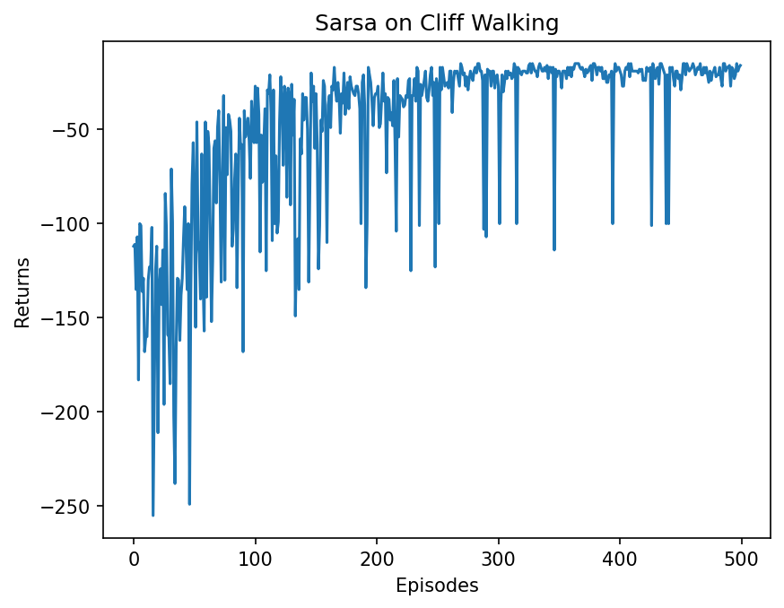
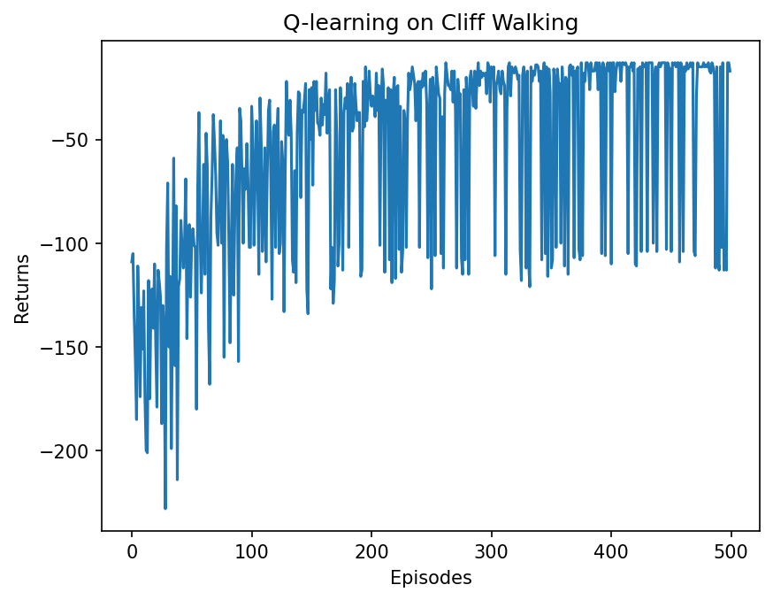
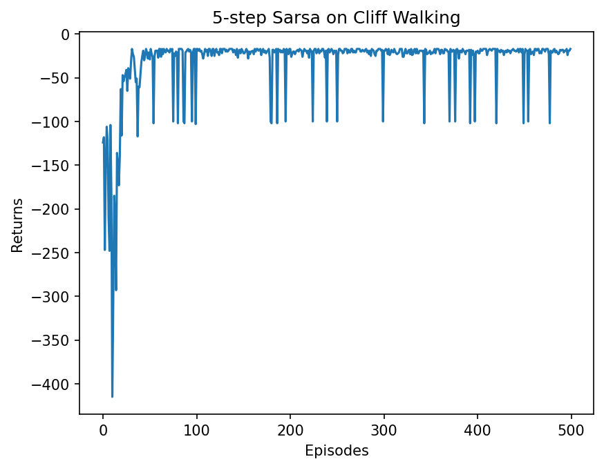

# TD 学习整合笔记：SARSA、Q-learning 与 n-step SARSA

这份笔记基于我当前项目中的三份代码整理而成：

- `TD/Sarsa.py`
- `TD/QLearning.py`
- `TD/nstep_Sarsa.py`

实验环境统一使用本地 `conda` 环境 `rl` 运行，命令形式为：

```powershell
conda activate rl
python TD\Sarsa.py
python TD\QLearning.py
python TD\nstep_Sarsa.py
```

为了避免绘图窗口阻塞，也可以临时使用：

```powershell
$env:MPLBACKEND='Agg'
python TD\Sarsa.py
```

---

## 1. TD 算法到底在做什么

TD（Temporal Difference，时序差分）方法的核心思想是：

> 不必等一整条轨迹结束，再统一回头计算回报；
> 只要走出一步，就可以立刻利用“当前奖励 + 对未来的估计”来更新当前价值。

如果用一句话概括：

```text
TD = 用一步经验，去逼近长期价值
```

这也是它和 Monte Carlo 的主要区别：

- Monte Carlo：必须等回合结束，才能知道完整回报
- TD：每走一步就更新一次，学习更及时

所以 TD 可以看成：

```text
动态规划的“自举思想” + 蒙特卡洛的“直接采样经验”
```

---

## 2. 这三个算法的共同点

这三份代码都是在学动作价值函数 `Q(s, a)`，并且都属于：

- `Model-Free`
- `Value-Based`
- `TD Learning`

共同框架都可以写成：

```text
Q(s, a) <- Q(s, a) + alpha * [Target - Q(s, a)]
```

其中：

- `Q(s, a)` 是当前估计
- `Target` 是这次更新想逼近的目标
- `Target - Q(s, a)` 就是 TD error

真正区分 SARSA、Q-learning 和 n-step SARSA 的，不是“动作怎么选”，而是：

```text
Target 到底怎么构造
```

---

## 3. Cliff Walking 环境在学什么

三份代码都使用了同一个悬崖漫步环境。

环境大小：

- `nrow = 4`
- `ncol = 12`

起点在左下角，终点在右下角，中间一长排是悬崖。

规则是：

- 普通走一步：奖励 `-1`
- 掉进悬崖：奖励 `-100`，并终止
- 到达终点：终止

这意味着智能体要在两种倾向之间权衡：

- 走靠近悬崖的最短路径，步数少，但风险大
- 走离悬崖远一点的安全路径，步数多，但更稳

这个环境特别适合对比 SARSA 和 Q-learning，因为它们对“探索风险”的态度不一样。

---

## 4. SARSA

### 4.1 更新公式

SARSA 的名字来自一条转移链：

```text
S -> A -> R -> S' -> A'
```

更新公式：

```text
Q(s, a) <- Q(s, a) + alpha * [r + gamma * Q(s', a') - Q(s, a)]
```

这里最关键的是：

- `a'` 不是理论上最优动作
- `a'` 是智能体下一步真的按当前策略选出来的动作

所以 SARSA 学习的是：

```text
“我当前这套行为策略，真实执行下去会得到什么结果”
```

这就是 `On-Policy`。

### 4.2 代码里的核心更新

来自 `TD/Sarsa.py`：

```python
def update(self, s0, a0, r, s1, a1):
    td_error = r + self.gamma * self.Q_table[s1, a1] - self.Q_table[s0, a0]
    self.Q_table[s0, a0] += self.alpha * td_error
```

动作选择使用的是 `epsilon-greedy`：

```python
def take_action(self, state):
    if np.random.random() < self.epsilon:
        action = np.random.randint(self.n_action)
    else:
        action = np.argmax(self.Q_table[state])
    return action
```

这说明 SARSA 完全可以用 `argmax` 做大部分决策，小概率再随机探索。它不是“不允许贪心”，而是：

```text
更新时必须跟着当前真实行为策略走
```

### 4.3 一轮交互流程

SARSA 的执行顺序很适合直接背下来：

1. 在状态 `s` 先选出当前动作 `a`
2. 执行动作，得到 `r, s'`
3. 再按当前策略在 `s'` 选出 `a'`
4. 用 `Q(s', a')` 更新 `Q(s, a)`
5. 然后令 `s <- s'`，`a <- a'`

---

## 5. Q-learning

### 5.1 更新公式

Q-learning 的更新是：

```text
Q(s, a) <- Q(s, a) + alpha * [r + gamma * max_a' Q(s', a') - Q(s, a)]
```

和 SARSA 最大的区别是：

- SARSA 用的是 `Q(s', a')`
- Q-learning 用的是 `max Q(s', a')`

也就是说，Q-learning 在更新时总是假设：

```text
未来一定会选最优动作
```

因此它学到的是：

```text
“理论最优策略”的价值
```

这就是 `Off-Policy`。

### 5.2 代码里的核心更新

来自 `TD/QLearning.py`：

```python
def update(self, s0, a0, r, s1):
    td_error = r + self.gamma * self.Q_table[s1].max() - self.Q_table[s0, a0]
    self.Q_table[s0, a0] += self.alpha * td_error
```

这里 `take_action()` 同样还是 `epsilon-greedy`，所以需要特别注意：

```text
Q-learning 的 Off-Policy，不是说它不探索，
而是说“行为策略”和“学习目标策略”可以不一致。
```

行为时可能随机探索，学习时却总按最优未来去更新。

---

## 6. n-step SARSA

### 6.1 为什么要引入 n-step

一步 TD 更新虽然及时，但只看一步，信息传播可能偏慢。

于是 n-step SARSA 会把后面连续 `n` 步奖励一起考虑进去：

```text
一步 TD：看得近，更新快
多步 TD：看得更远，信息传播更快
```

所以它可以看成 TD 和 Monte Carlo 之间的折中：

- `n = 1` 时，退化成普通 SARSA
- `n` 很大时，会越来越接近 Monte Carlo

### 6.2 更新思想

n-step SARSA 的目标大致是：

```text
G_t^(n) = r_t + gamma r_(t+1) + ... + gamma^(n-1) r_(t+n-1) + gamma^n Q(s_(t+n), a_(t+n))
```

也就是：

- 前面 `n` 步奖励是真实采样到的
- 最后再接一个 bootstrap 项 `Q(s_(t+n), a_(t+n))`

### 6.3 代码里的关键逻辑

来自 `TD/nstep_Sarsa.py`：

```python
if len(self.state_list) == self.n:
    G = self.Q_table[s1, a1]
    for i in reversed(range(self.n)):
        G = self.gamma * G + self.reward_list[i]
    s = self.state_list.pop(0)
    a = self.action_list.pop(0)
    self.reward_list.pop(0)
    self.Q_table[s, a] += self.alpha * (G - self.Q_table[s, a])
```

这里可以这样理解：

1. 先把最近几步的状态、动作、奖励缓存起来
2. 当累计到 `n` 步后，反向计算 `n` 步回报 `G`
3. 用这个 `G` 去更新最早那个状态动作对

---

## 7. 三种算法的本质区别

最值得记住的一张表其实是这个：

| 算法 | 更新目标 | 策略类型 | 直觉 |
| --- | --- | --- | --- |
| SARSA | `r + gamma Q(s', a')` | On-Policy | 学当前真实执行策略 |
| Q-learning | `r + gamma max Q(s')` | Off-Policy | 学理论最优策略 |
| n-step SARSA | 多步回报 + `Q(s_(t+n), a_(t+n))` | On-Policy | 比一步 SARSA 看得更远 |

如果只记一句话：

- SARSA 更在意“探索时真的会发生什么”
- Q-learning 更在意“如果以后都最优，会怎样”
- n-step SARSA 在 SARSA 的基础上增强了回报传播

---

## 8. 本地代码运行结果

本节结果来自本地 `rl` 环境实际运行。

### 8.1 SARSA 的回报表现

`TD/Sarsa.py` 在第 500 个 episode 附近，最近 10 条轨迹平均回报约为：

```text
-18.900
```

最终策略输出为：

```text
ooo> ooo> ooo> ooo> ooo> ooo> ooo> ooo> ooo> ooo> ooo> ovoo
ooo> ooo> ooo> ooo> ooo> ooo> ooo> ooo> ooo> ooo> ooo> ovoo
^ooo ooo> ^ooo ooo> ooo> ooo> ooo> ^ooo ^ooo ooo> ooo> ovoo
^ooo **** **** **** **** **** **** **** **** **** **** EEEE
```

可以看出 SARSA 学到的是一条相对保守的路径，整体上会尽量避免紧贴悬崖。

生成的曲线图：



### 8.2 Q-learning 的回报表现

`TD/QLearning.py` 在第 500 个 episode 附近，最近 10 条轨迹平均回报约为：

```text
-61.700
```

最终策略输出为：

```text
^ooo ovoo ovoo ^ooo ^ooo ovoo ooo> ^ooo ^ooo ooo> ooo> ovoo
ooo> ooo> ooo> ooo> ooo> ooo> ^ooo ooo> ooo> ooo> ooo> ovoo
ooo> ooo> ooo> ooo> ooo> ooo> ooo> ooo> ooo> ooo> ooo> ovoo
^ooo **** **** **** **** **** **** **** **** **** **** EEEE
```

这次单次实验里，Q-learning 后期波动明显更大。原因不是它“学得差”，而是：

- 它更新时总按最优未来估计
- 但行为时仍然保留 `epsilon=0.1` 的探索
- 在悬崖环境中，探索一步就可能掉崖，回报会突然大幅下降

所以在“训练期间的真实回报”上，它不一定比 SARSA 看起来更稳。

生成的曲线图：



### 8.3 5-step SARSA 的回报表现

`TD/nstep_Sarsa.py` 使用 `n_step = 5`，在第 500 个 episode 附近，最近 10 条轨迹平均回报约为：

```text
-19.100
```

从这次实验看，它和普通 SARSA 的最终表现非常接近，但前期回报改善更快，说明多步回报确实帮助价值更快向前传播。

生成的曲线图：



### 8.4 结果对比总结

这次运行下可以先得到一个经验结论：

- SARSA：更稳，学到的路径更保守
- Q-learning：目标更激进，但训练期真实回报可能更抖
- 5-step SARSA：兼顾及时更新和更快的回报传播

注意这里的数值结论只对应这一次固定随机种子的实验：

- `np.random.seed(0)`
- `epsilon = 0.1`
- `alpha = 0.1`
- `gamma = 0.9`
- `num_episodes = 500`

如果改变随机种子、探索率或训练轮数，三者的回报曲线会有变化，但它们的“性格差异”通常仍然成立。

---

## 9. 为什么 SARSA 在悬崖环境里往往更保守

这是理解这三种算法时最重要的直觉之一。

假设智能体已经学会了一条“贴着悬崖走的最短路径”。

如果使用 Q-learning：

- 更新时默认未来总能选到最优动作
- 所以它认为贴边走是高价值的

但如果使用 SARSA：

- 更新时会把 `epsilon-greedy` 的探索风险也算进去
- 也就是说，它知道“即使现在贴边很短，但我下一步可能随机走错，然后掉崖”

因此 SARSA 对贴边路径的估值会更保守，最后策略也更倾向安全路线。

这不是公式记忆问题，而是：

```text
SARSA 学的是“带探索噪声的真实执行结果”
Q-learning 学的是“理想最优执行结果”
```

---

## 10. 从代码角度看，最值得掌握的三个点

### 10.1 `take_action()` 和 `update()` 要分开理解

很多初学者容易把“怎么选动作”和“怎么更新价值”混在一起。

其实应该拆开看：

- `take_action()`：决定你在环境中怎么行动
- `update()`：决定你拿什么 target 学习

SARSA 和 Q-learning 常常用同样的 `epsilon-greedy` 行为策略，但更新目标不同，所以算法本质仍然不同。

### 10.2 TD error 是学习驱动力

不管是一步还是多步，本质都是在修正估计误差：

```text
TD error = Target - Current Estimate
```

如果误差大，就改得多；
如果误差小，就改得少。

### 10.3 Q 表是“逐步传播”学出来的

在这些表格算法里，终点附近先学到更可靠的价值，然后价值再一层层往前传。

所以前期常见现象是：

- 一开始回报很差
- 后面突然明显改善

这不是偶然，而是价值传播到前面状态之后，策略才开始真正成型。

---

## 11. 这部分内容和后续 DQN 的关系

这三种方法虽然都是表格法，但它们和后面的 DQN 是直接连起来的。

可以这样对应：

- 表格 `Q(s, a)` 变成神经网络 `Q_theta(s, a)`
- TD target 的思想保留下来
- Q-learning 的 `max Q(s', a')` 目标也保留下来

所以学 DQN 之前，必须先把这里真正看懂：

- 为什么要 bootstrap
- 为什么 target 是“奖励 + 对未来的估计”
- 为什么行为策略和学习目标策略可以不同

---

## 12. 一句话总结

如果把这一节压缩到最小：

- SARSA：按当前真实策略学，保守，On-Policy
- Q-learning：按最优目标学，激进，Off-Policy
- n-step SARSA：在 SARSA 上看得更远，是 TD 和 Monte Carlo 的折中

而 TD 方法本身的核心，就是：

```text
不用等到未来真的全部发生完，
也能用“当前奖励 + 对未来的估计”持续改进价值函数。
```
