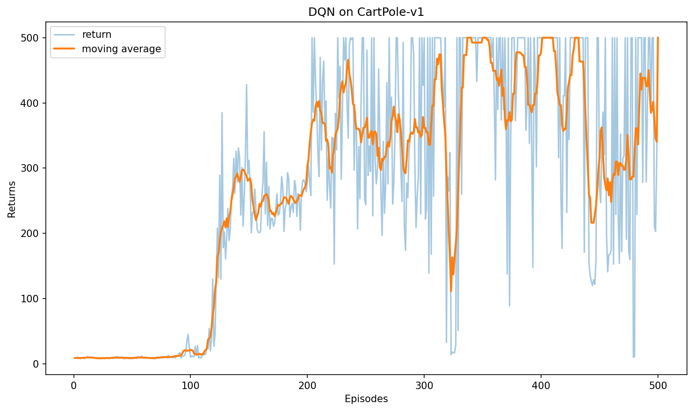
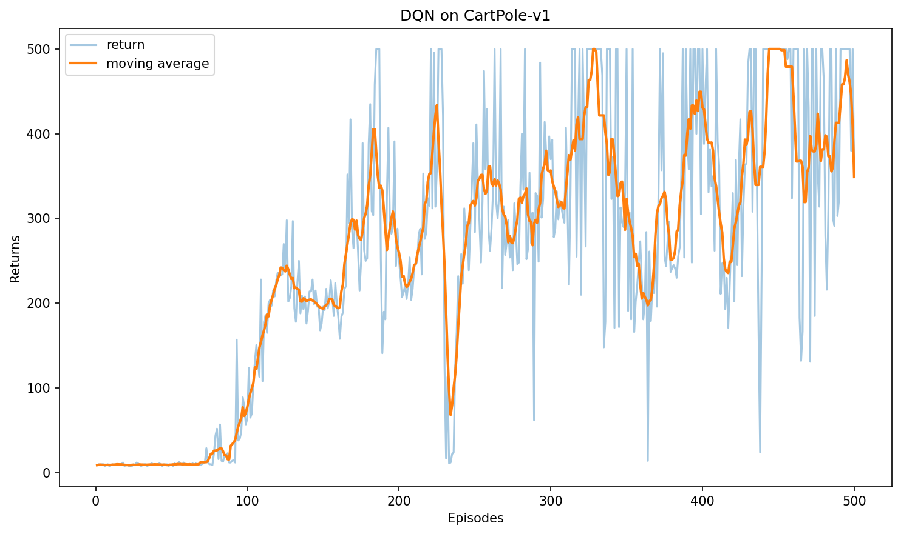
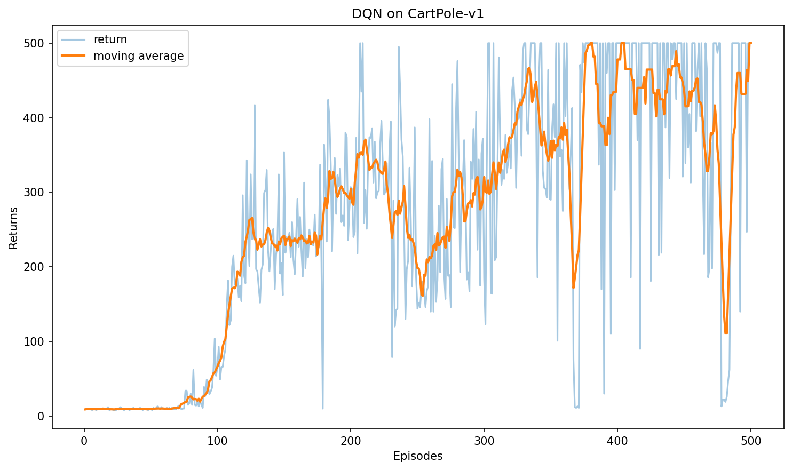
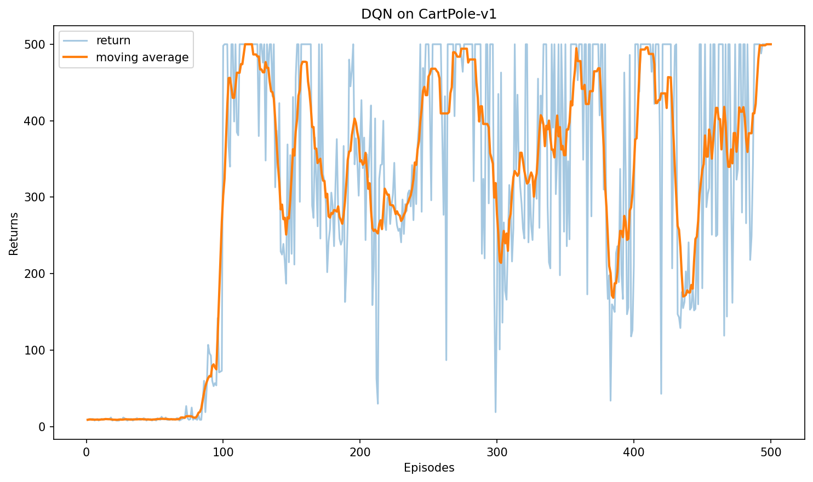
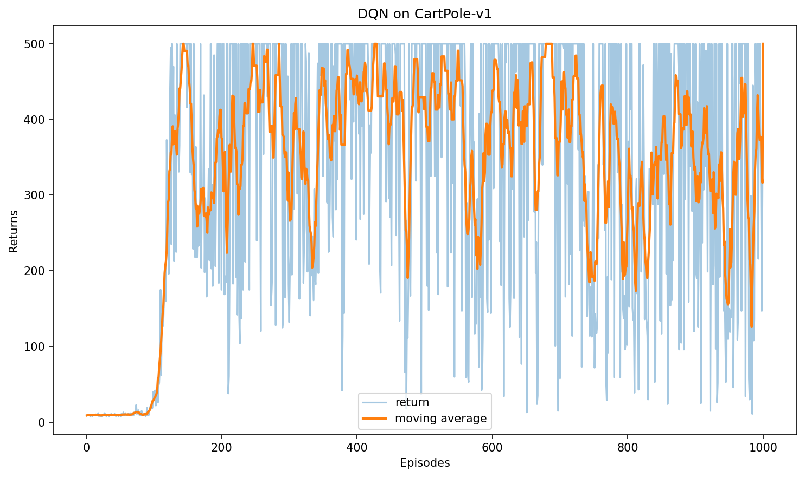
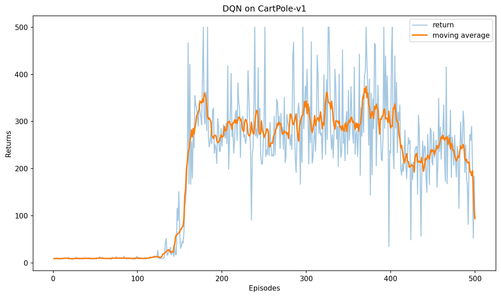
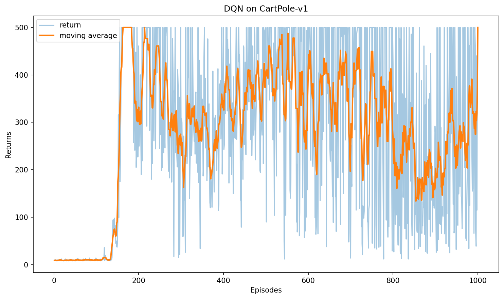

# 第一周周报
2026/5/10

## 一、本周学习内容

本周主要沿着强化学习的基础路线学习，并重点研究完成了一个 DQN 在 `CartPole-v1` 环境中的初步实验。其中强化学习基础学习内容包括：`MAB`，`Markov`，`Dynamic_programming`，`TD`，`DQN`。其中前四部分以基础知识梳理和代码理解为主，`DQN` 是本周学习重点。

## 二、基础部分总结

### 1. MAB（多臂老虎机问题）

本周首先学习了多臂老虎机问题，重点理解了探索与利用的基本矛盾，也接触了 epsilon-greedy、UCB、Thompson Sampling 等常见探索方法。这部分较为简单，主要是理解了“探索”与“利用”的平衡。

### 2. Markov（马尔可夫）

这一块学习了马尔可夫奖励过程和马尔可夫决策过程部分。主要梳理了状态、转移、奖励、回报和价值函数等基础概念定义并理解了贝尔曼方程迭代过程，为后面具体算法学习奠定了理论基础，例如未来价值的迭代方式，这种相似的思路在Q-Learning，SARSA和DQN中都出现了。

### 3. Dynamic_programming（动态规划算法）

动态规划部分重点看了策略评估、策略迭代和值迭代。通过代码实现，对贝尔曼方程和价值传播过程有了更直观的认识，也更清楚地理解了“先评估、再改进”的基本思路。同时也理解了动态规划的局限性，仅针对于可以具体建模的情景才能使用，难以直接应用于高维复杂具身智能真正的环境中。

### 4. TD（时序差分算法）

TD 部分主要学习了 SARSA、Q-learning 和 n-step SARSA，并结合 `Cliff Walking` 环境做了实验。实验结果中两种两种算法出现了不同结果，刚好印证了SARSA往往更保守而Q-Learning往往更激进。这一点又呼应到前面学习贝尔曼方程的迭代公式，直观表现了按照策略迭代和最优动作迭代时的不同

## 三、本周重点学习：DQN

前面的基础学习还属于较为传统的强化学习算法，到了这一步才算开始接触强化学习与神经网络结合的方式，在这一板块上本周花了较多的时间。

### 1. 工作内容

本周围绕 `DQN` 主要完成了多组 `CartPole-v1` 对比实验，工作内容包括：

1. 搭建并跑通 DQN 训练脚本
2. 完成训练结果保存，包括权重、训练曲线和超参数
3. 编写推理脚本，支持加载权重进行可视化测试
4. 基于不同超参数组合进行多组实验对比

### 2. 实验结果

本周一共保留了 7 组实验结果，并统一用 3 次推理回报做对比：

| 实验编号 | 主要参数变化 | 3次推理回报 | 平均回报 |
| --- | --- | --- | --- |
| 1 | `epsilon=0.01, target_update=10, episodes=500` | `239 / 228 / 223` | `230.0` |
| 2 | `epsilon=0.1, target_update=10, episodes=500` | `500 / 500 / 500` | `500.0` |
| 3 | `epsilon=0.1, target_update=20, episodes=500` | `500 / 500 / 500` | `500.0` |
| 4 | `epsilon=0.1, target_update=40, episodes=500` | `500 / 500 / 500` | `500.0` |
| 5 | `epsilon=0.1, target_update=20, episodes=1000` | `500 / 500 / 500` | `500.0` |
| 6 | `epsilon=0.1, target_update=20, episodes=500, buffer=50000, minimal=1000` | `217 / 207 / 221` | `215.0` |
| 7 | `epsilon=0.1, target_update=20, episodes=1000, buffer=50000, minimal=1000, batch=128` | `500 / 500 / 500` | `500.0` |

各组训练曲线如下：

实验 1：`epsilon=0.01, target_update=10, episodes=500`

实验 2：`epsilon=0.1, target_update=10, episodes=500`

实验 3：`epsilon=0.1, target_update=20, episodes=500`

实验 4：`epsilon=0.1, target_update=40, episodes=500`

实验 5：`epsilon=0.1, target_update=20, episodes=1000`

实验 6：`epsilon=0.1, target_update=20, episodes=500, buffer=50000, minimal=1000`

实验 7：`epsilon=0.1, target_update=20, episodes=1000, buffer=50000, minimal=1000, batch=128`

### 3. 结果分析

从这 7 组结果看，`epsilon` 的影响最明显。实验 1 使用 `epsilon=0.01` 时，平均回报只有 `230.0`；而把 `epsilon` 提高到 `0.1` 后，在其余参数基本不变的情况下，实验 2 已经可以稳定达到 `500`。这说明前面表现不理想的主要原因不是网络结构本身，而是探索不足。

在 `epsilon=0.1` 的前提下，`target_update` 从 `10` 调到 `20`、`40`，在 `500` 轮训练内都能达到 `500`，说明这几个设置在当前任务上的差别不大，至少都足够把 `CartPole-v1` 解出来。

**方智睿**学长曾建议我在训练过程中可以放大经验回放池来观测训练效果，实际实验中发现更大的回放池并不一定立刻更好。实验 6 将 `buffer_size` 提高到 `50000`，同时把 `minimal_size` 提高到 `1000`，但在 `500` 轮训练下平均回报只有 `215.0`，反而更差，说明更保守的采样设置会拖慢前期学习速度。如果训练轮数不够，效果反而不如原来的配置。

不过实验 7 也说明这类设置不是无效，而是需要配合更长训练时间。把训练轮数增加到 `1000`，并把 `batch_size` 调到 `128` 后，结果重新达到了 `500`。

如果只看当前实验结果，本周表现最好的方案有实验 2、3、4、5、7，这几组都能稳定达到满分 `500`。如果从“改动最小但提升最明显”的角度看，实验 2 是当前最值得保留的方案，因为它只把 `epsilon` 从 `0.01` 调到 `0.1`，其余参数基本不变，就已经把表现从 `230` 左右提升到了稳定 `500`。

但个人感觉其实这个实验的结果并不算非常理想，一个原因是这个场景还是有些**太过简单**，哪怕是一组较差的参数也能在大量的训练轮数中达到一个较为稳定的结果。另一个原因是目前尚且缺乏一定的训练经验，对于训练过程的各个超参数只存在一个概念性的理解，还不能根据实验情景准确的给出一个合理的数量级范围。

针对这两个缺点，我目前有两个打算，一是使用更为真实的仿真环境，例如之前使用过的**mujoco**场景，尝试在这样更真实的物理环境中使用我的训练算法，同时关注更多超参数对训练结果变化的情况，进行一个更为完整的实验。二是继续学习新的算法，如目前正在学习的改良DQN，将不同的算法针对一个相同的情景进行对比，看看我的问题具体出在哪里。

另外，之前在与方学长的交流过程中，他建议我做好实时总结，对于多种算法他们都存在某些相同的共性，例如on policy或off policy等等。后文总结中会包含本周学习的算法的一些基础的归类。

## 四、本周总结

这一周的学习基本把前半段强化学习内容串起来了。前面的 `MAB`、`Markov`、`Dynamic_programming` 和 `TD` 主要帮助建立基础框架，`DQN` 则是在这个基础上进一步做了第一次较完整的算法实践。

另外，这一周也开始对强化学习算法的分类有了更清楚的认识，在时序差分算法学习时了解到 `On-Policy` 和 `Off-Policy` 的概念，并进一步理解了 `Model-Free` 这一类方法。

`On-Policy` 可以理解为，智能体按照什么策略与环境交互，就学习这套正在执行的策略本身。这类方法通常更贴近真实执行过程，更新相对保守。

`Off-Policy` 可以理解为，智能体可以用一种策略和环境交互，但学习的目标是另一套更偏“理想最优”的策略。这类方法通常样本利用率更高，也更适合配合经验回放池使用。

`On-Policy`与`Off-Policy`的一种典型区分方式就是可以通过看计算时序差分的价值目标的数据是否来自当前的策略，很显然两者所依据的贝尔曼更新方程不尽相同。

`Model-Free` 可以理解为：不显式使用环境的状态转移模型和奖励模型，而是直接依靠与环境交互得到的数据进行学习。本周接触到的 SARSA、Q-learning 和 DQN 都属于这一类。

结合本周学过的内容，可以做一个简单划分：

| 分类维度 | 类别 | 代表内容 | 简要说明 |
| --- | --- | --- | --- |
| 按策略关系划分 | `On-Policy` | SARSA、n-step SARSA | 按当前真实执行策略进行学习，通常更保守 |
| 按策略关系划分 | `Off-Policy` | Q-learning、DQN | 行为策略和学习目标可以不同，通常更激进 |
| 按是否依赖环境模型划分 | `Model-Free` | SARSA、n-step SARSA、Q-learning、DQN | 不显式使用环境模型，直接通过交互样本学习 |

## 五、未来方向

本周非常感谢方学长在学习路线和论文阅读方面给予的很多指导，这让我开始更加认真地思考自己未来希望深入的研究方向，也进一步坚定了我继续往具身智能方向学习的想法。

结合本科阶段这几年参与**机器人**相关项目的经历，我逐渐意识到，传统机器人系统往往更偏向于**单模块优化**，例如运动控制、路径规划或视觉识别，而真正的具身智能，更强调机器人在真实物理环境中的**完整闭环能力**，即从外部环境感知、任务理解，到内部决策，再到最终动作执行的整体协同。

这周在学长的建议下，我阅读了论文《π0: A Vision-Language-Action Flow Model for General Robot Control》。这篇工作让我第一次比较直观地理解到，机器人并不一定只能依赖传统"**一个任务对应一个控制器**"的方式进行工作，而是可以通过统一的 Vision-Language-Action（VLA）范式，将视觉、语言与动作统一建模，从而在不同任务、不同机体之间实现一定程度的泛化与迁移。

这与我过去对机器人控制的理解有很大不同。过去我更多关注的是强化学习在机器人**运动控制**中的应用，例如如何让机器人走得更稳、控制更加鲁棒；但在阅读相关工作后，我开始意识到，视觉信息、语言指令以及长期任务规划同样可以被纳入机器人**决策系统**中，使机器人不仅能够完成**底层控制**，还能够完成更复杂的**长程任务**。

因此，我希望后续能够逐步从当前的强化学习基础学习，进一步过渡到更加接近真实机器人的任务环境，例如 Mujoco、Isaac Gym 或 legged_gym 等平台，继续学习 PPO、SAC 等更适用于连续控制任务的强化学习方法，并进一步了解 VLA、模仿学习以及多模态具身智能相关工作。

当前阶段我希望先把强化学习与机器人控制相关基础打扎实，再逐步过渡到更复杂的具身任务场景。总而言之，目前我比较感兴趣的方向是：如何让机器人能够基于视觉、语言等多模态输入，在真实物理场景中完成具有长期目标的任务，并逐步形成从感知、决策到执行的完整闭环能力。
